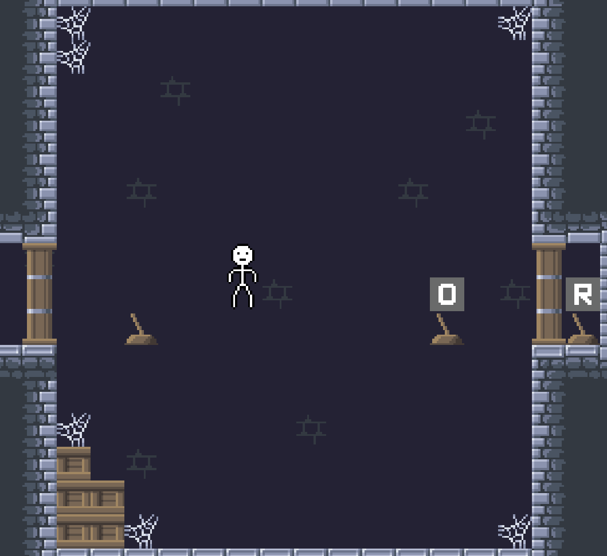
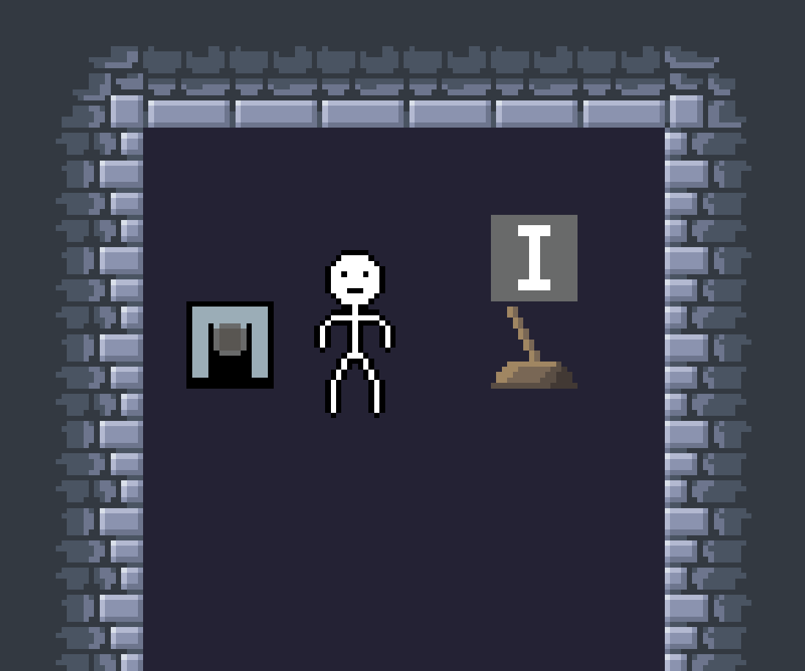

# Два уровня со спавнером

Замените содержимое папки `Resources` на содержимое папки `twolevelsspawner`

Пример представляет собой 2 уровня:
* Первый уровень - 3 рычага
    * Первый загружает второй уровень
    * Второй открывает/закрывает дверь
    * Третий перезагружает уровень (если, например, вы застряли за дверью)

* Второй уровень - спавнер и рычаг
    * Спавнер при взаимодействии создает самоуничтожающийся со временем снаряд, но в один момент времени
    может существовать только один снаряд
    * Рычаг загружает первый уровень

У игрока настроена анимация ходьбы, у камеры настроены размеры и рамка для нее
