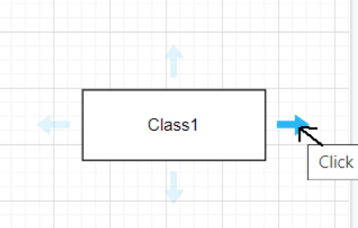

# Руководство по написанию кода в draw.io

По ходу руководства будет разобран пример создания пары простых
игровых элементов для лучшего закрепления материала.

## Подготовка
Редактор кода - draw.io. У него есть как [онлайн-версия](https://draw.io),
так и [десктопная](https://github.com/jgraph/drawio-desktop/releases)
(скачивать так же (из релизов), как NamedEngine в [соответствующем руководстве](install.md)).

Если вы работаете в онлайн-версии, то первым делом вам надо будет выбрать место для сохранения файлов:

Наиболее простым вариантом будет сохранять весь код в папке **Resources** в вашей установке
NamedEngine, чтобы не заморачиваться с постоянным переносом файлов после редактирования.
Поэтому выберите **Device**, а конкретное место для сохранения выбрать будет предложено
сразу после выбора типа диаграммы и нажатия кнопки создания.
  
Пользователям десктопной версии выбрать место будет предложено при первой попытке сохраниться.

Создаем новую диаграмму:

Далее:

Выбираем тип файла - XML File - и называем нашу диаграмму, после чего жмякаем на "create".
  
Тут онлайн-пользовали и сохранят код в конкретную папку.
Десктопным пользователям тоже рекомендую это сделать (ctrl+s / File->Save).

Далее необходимо в File > Properties отжать галочку у Compressed. Без этого движок кодом подавится.

Последний пункт подготовки - загрузка в проект набора блоков NamedLanguage.
Их можно найти [тут](https://github.com/NamedEngine/drawio-blocks):

Скачанный архив надо распаковать

Далее в интерфейсе draw.io:

Выбираете NamedLanguage.xml в распакованном архиве

И вот что должно получиться после импорта:

Теперь можно приступать к разработке.

## Разработка

Опишем простую систему для созданной в [руководстве по работе с tiled](tiled.md) карты:

Сделаем так, чтобы по взаимодействию игрока с рычагом (Lever) ворота (Right Gate)
отъезжали наверх или возвращались на свое место.

Для начала перетащим на диаграмму (то есть создадим) блок типа Class.
Этот блок будет основой описания поведения всех объектов, которые можно будет
заставить отъехать в сторону, поэтому назовем класс Slider:

Наш слайдер не будет отъезжать в сторону сам по себе, рычаг должен "сказать" ему отъехать.
Объекты в NamedLanguage могут заимодействовать между собой только через данные, поэтому
заведем переменную ShouldSlide логического типа Bool (может быть либо true, либо false).
Именно через нее мы узнаем от рычага, когда надо будет двигаться, причем по умолчанию двигаться
нам не надо.
Чтобы ее завести, перетащим нужный блок из набора и введем следующие данные:

Переменная присоеденена к классу, чтобы показать, что она принадлежит именно ему.

**Чтобы провести стрелку от одного блока к другому**, наведите указатель на блок, от которого
хотите провести стрелку, затем нажмите на одну из четырех появившихся полупрозрачных стрелок и
протяните, куда требуется:

Переменную создали, но теперь надо как-то определить, что двигаться надо начать.\
Для этого существует особый тип блоков - условия. Если они выполняются, то они запускают следующие
за ними условия/действия.\
Создадим условие IsTrue, которое принимает 1 параметр типа Bool и
выполняется, если переданное значение - true в момент проверки. Шаблон условия уже имеет 1 параметр,
поэтому их количество менять не придется, нужно только правильно назвать само условие.\
После этого
присоединяем класс к условию (чтобы показать, для чего должно проверяться это условие) и передадим
переменную ShouldSlide в первый и единственный параметр IsTrue, присоединив переменную к нему как
на картинке (соединяем именно с параметром):

Если условие выполняется, хотелось бы, чтобы дверь отъехала в сторону: создадим действие MoveInTime.
Оно принимает 3 параметра, поэтому дополнительные получаем либо путем переноса с панели блоков, либо
путем копирования существующего. Новые параметры "вставляем" в MoveInTime, а само действие соединяем
с условием, после которого оно должно идти:

Мы могли сразу вбить в параметры нужные значения, но тогда все объекты, которым мы зададим класс
Slider, всегда будет двигаться в одном и том же направлении, да еще и обратно возвращаться не будут.
Поэтому значения мы передадим из переменных, а в параметры впишем более информативный текст, чтобы
проще было разбираться в визуальном коде:

Создадим соответствующие перемнные, запишем их значения по умолчанию в 0 и передадим в MoveInTime:

Конкретные значения для каждого объекта класса Slider мы укажем в самом объекте в Tiled.

После того, как передвижение будет осуществлено, хочется, чтобы следующее движение (когда Slider'у
скажут двигаться) было совершено в обратном направлении. Для этого перезапишем значения переменных
DeltaX и DeltaY обратными значениями. Ну а чтобы получить обратные значения, умножим текущие на -1
с помощью оператора MultiplyF, который передадим в новое действие SetFloat:

(Это я еще раз обращаюю внимание на то, что **значение DeltaX мы передаем в параметр и присоединяем
к нему**, как и MultiplyF присоединяем к параметру source).

В качестве второго параметра MultiplyF используем -1, т.к. хотим умножить значение переменной на -1.
В SetFloat же первый параметр - результирующее значение типа Float, которое надо записать в переменную
типа Float, а второй - сама переменная типа Float, куда мы это значение записываем:

Получается, что мы взяли значение DeltaX, умножили на -1 и записали обратно. Как и планировалось!

Повторяем для DeltaY, а так же записываем false в ShouldSlide, т.к. двигаться нам больше не надо:

Теперь нам нужно написать код для рычага, который будет управлять нашей дверью. Но, т.к. управлять
Slider'ом не обязательно должен рычаг, а может быть, например, и кнопка, то назовем класс в более
общих терминах: SliderTrigger:

Итак, мы хотим, чтобы Slider начинал двигаться после взаимодействия с Trigger'ом, поэтому добавим
соответствующее условие: Interact. Оно срабатывает, когда игрок взаимодействует с объектом (нажимает
специальную клавишу, когда игрок и объект пересекаются) и не принимает никаких параметров (единственный
удалим):

После этого поставим проверку на то, что Slider еще не двигается:

Однако тут возникает вопрос: как нам взять переменную ShouldSlide? Если мы просто протащим ее от
класса Slider, то как движок должен понять, из какого конкретно объекта мы должны эту перемнную брать
(потому что на уровне у нас может быть сколько угодно ворот/прочих Slider'ов)?

Ответ: надо знать имя нужного объекта. Создадим для этого переменную (чтобы в каждом конкретном
Trigger'е указывать соответствующий ему Slider):

Далее воспользуемся специальным оператором, который позволяет получать доступ к переменным других
объектов, зная их имя. Передадим созданную переменную в этот оператор(и ЕЩЕ раз обращаю внимание,
что стрелочка проведена к конкретному параметру):

Вторым аргументом передадим ссылку на переменную, которая присоединена к ссылке на класс. Такая
конструкция позволяет показать, что у нас есть класс Slider, обладающий переменной ShouldSlide,
но объявили их мы где-то в другом месте (даже в другом файле, возможно):

Вместо ссылки на класс можно воспользоваться и объявленным классом (но не объявленной переменной,
нужна именно ссылка):

Проверяем "выцепленную" переменную в условии и перезаписываем ее же на true, если до этого она
была false:

Ну и одна из самых важных деталей: отмечаем, что с нашими Trigger'ами можно взаимодействовать:

У нашего объекта(в данном случае слоя-картинки)-рычага указываем класс и имя соответствующего
ему слайдера:

У ворот указываем класс, перемещение по x(опционально, по умолчанию ведь и так 0), перемещение по
y(-48 пикселей -> размер ворот в пикселях, минус потому что вверх (ох уж эти оси в Tiled)) и время
в секундах:

Если до этого не было игрока, то создаем и его, используя класс TopDownPlayer(игрок для игр с
видом сверху) и указываем его скорость в пикселях в секунду.

Запускаем движок. Управление игроком - WASD, взаимодействие - E.

Наслаждаемся результатом:

