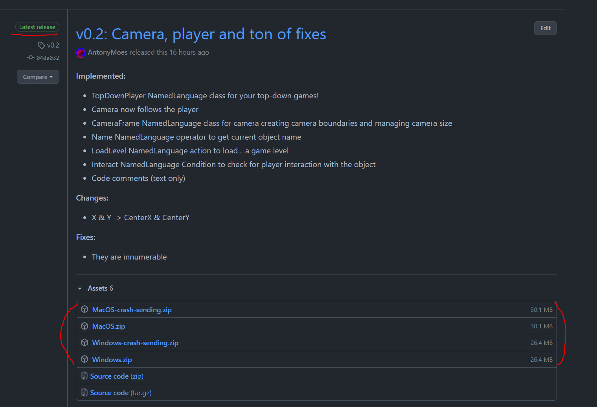

# Руководство по установке NamedEngine и работе с ним
## Установка
Движок можно загрузить [тут](https://github.com/NamedEngine/runtime/releases).
Находите релиз, который помечен как последний, и скачиваете zip-архив для вашей ОС:

В чем различие между версиями "название-ос" и "название-ос-crash-sending"?
Вторая автоматически отправляет мне на почту все отчеты о произошедших у вас ошибках движка.
Если такое поведение кажется вам слишком инвазивным (хотя оно и знатно сэкономит время при тестировании),
то можете отправлять отчеты об ошибках вручную (об этом позже).

Загруженный архив распакуйте в удобное для вас место

## Работа
В распакованной папке сам файл движка будет находиться под названием **NamedEngine** (.exe - Windows, .app - Mac).

Все игровые файлы необходимо помещать в папку **Resources**, так как движок не имеет право брать файлы из-за ее пределов

В случае, если после запуска движок сам по себе закроется, то можете быть уверены, что произошла ошибка.
Проверьте папку **Logs**, там должен был создаться файл формата **дата-время-exception.log**.
Если вы скачали версию с "-crash-sending", то он уже направлен мне на почту,
иначе можете отправить его сами на [namedengine@gmail.com](mailto:namedengime@gmail.com).

На этом все, удачной разработки!
