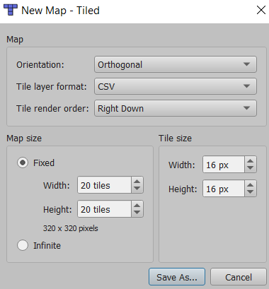
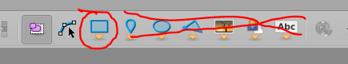
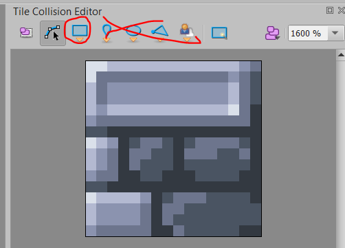

# Руководство по работе с Tiled Map Editor
Здесь будет руководство, как создать какой-нибудь уровень, но не сейчас.

Я в вас верю. Вы справитесь.

* [Загрузка](https://thorbjorn.itch.io/tiled)
  (Download now -> No thanks, just take me to the downloads)
* [Доки](https://doc.mapeditor.org/en/stable/)

## Главные моменты
1. Уровни и все файлы, которые они используют (тайлсеты, картинки), хранить в Resources

2. Основной уровень должен лежать по пути `Resources/Maps/main.tmx`

3. Поддерживаются только ортогональные карты, которые хранятся в CSV:
  
    

4. Для слоев объектов поддеживаются только прямоугольные объекты и точки:

    
  
5. **Поддеживается** и активно используется функция настройки коллизий для тайлов,
   но поддерживаются только прямоугольные коллизии (хоть их и можно использовать нeсколько):

    
