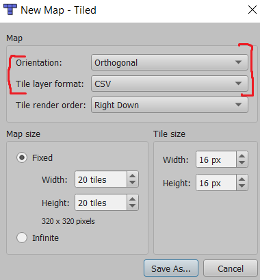

# Руководство по работе с Tiled Map Editor
Здесь будет руководство, как создать какой-нибудь уровень, но не сейчас.

Я в вас верю. Вы справитесь.

* [Загрузка](https://thorbjorn.itch.io/tiled)
  (Download now -> No thanks, just take me to the downloads)
* [Доки](https://doc.mapeditor.org/en/stable/)

## Главные моменты
-1. Уровни и все файлы, которые они используют (тайлсеты, картинки), хранить в Resources
0. Основной уровень должен лежать по пути `Resources/Maps/main.tmx`
   

1. Поддерживаются только ортогональные карты, которые хранятся в CSV и имеют фиксированный размер
  (но этот размер вы можете варьировать как хотите, как и размер тайлов).
  Вот такая конфигурация, короче (Save As -> .tmx):
  
    
2. Поддерживаются только тайлсеты, основанные на 1 картинке, при этом нельзя их встраивать
  и настраивать им spacing и margin (размеры тайлов опять-таки варьируются по желанию):

    
3. Для слоев объектов поддеживаются только прямоугольные объекты:

    
4. Для слоев объектов не поддерживается функция добавления тайла как объекта
   (добавлять только отдельным слоем-картинкой):

    
  
5. **Поддеживается** и активно используется функция настройки коллизий для тайлов,
   но поддерживаются только прямоугольные коллизии (хоть их и можно использовать нeсколько):

    

6. Активно используются свойства объектов, но со следующими ограничениями:
    * Попытка задать объекту несуществующий класс...
    * Попытка использовать для свойства любой тип данных, кроме [4 стандартных](../guides/types.md)...
    * Попытка задать объекту свойство, которого нет в его классе...
    * ...приведут к крашу

    

Если эти моменты не учесть, движок может крашнуться.

Пункты 0, 1(частично), 2, 4, 6 планируется в ближайшее время исправить.
